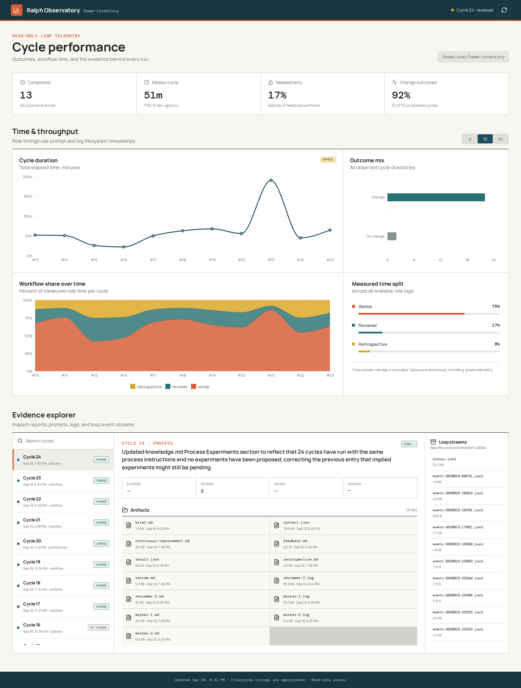
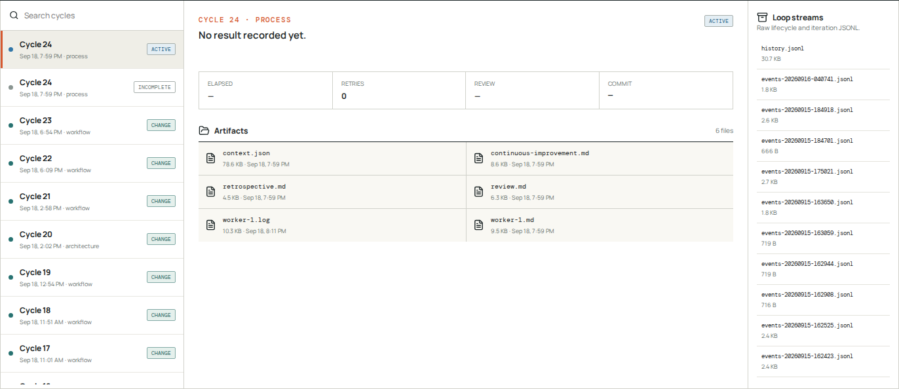
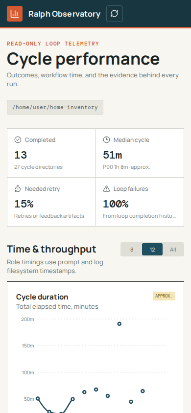

# Ralph Observatory

A read-only analytics and evidence viewer for a custom Ralph continuous-improvement loop implementation. It turns cycle state, reports, logs, retrospectives, and event streams into workflow analytics without modifying the observed project or maintaining a separate database.

This dashboard was built for the [home-inventory Ralph loop experiment](https://github.com/Maxim-Mazurok/home-inventory). Its parser follows that repository's `.ralph` runtime format rather than claiming compatibility with every tool or workflow called "Ralph."



<details>
<summary>Evidence explorer and mobile view</summary>





</details>

## AI authorship disclosure

This project is AI-generated and was not human-made. GitHub Copilot designed and implemented the application, documentation, and repository setup from a human-provided request. The screenshots display live data from the linked experiment repository.

## What it shows

- Cycle duration trends with median and P90 summaries
- Worker, reviewer, and retrospective time split and change over time
- Outcome distribution, retry rate, and loop failure rate
- Active and incomplete cycle state
- Live streaming of the active worker, reviewer, or retrospective log with automatic phase rollover and ANSI terminal colors
- Searchable per-cycle reports, prompts, logs, feedback, and JSON artifacts
- Raw loop history and iteration event streams

## Run

```bash
npm install
npm run dev
```

Open `http://localhost:5173`. Vite serves the React UI and proxies API requests to Express on port `4310`.

The default observed project is `/home/user/home-inventory`. Point the API at another compatible repository with:

```bash
RALPH_PROJECT_PATH=/path/to/project npm run dev
```

For a production-style local run:

```bash
npm run build
npm start
```

Open `http://localhost:4310`. Set `PORT` to change the Express port.

## Metrics

- Cycle outcomes and focus come from cycle `context.json`, `result.json`, and `accepted.json` files.
- Cycle elapsed time runs from the millisecond timestamp in the cycle directory name to the latest completion artifact.
- Worker, reviewer, and retrospective time is inferred from each attempt prompt's modification time through its log's modification time.
- "Needed retry" counts extra role attempts and feedback artifacts.
- Change outcome rate is the share of completed current-harness cycles whose accepted outcome is `change`, rather than `investigation` or `no_change`.

Filesystem-derived timings are marked approximate in the UI. They are useful for trends and workflow comparisons, but are not billing-grade telemetry.

## Safety

Artifact endpoints are restricted to known cycle directories and text formats, reject path traversal, and cap viewed files at 2 MB. The API exposes no write routes.

## Checks

```bash
npm run lint
npm run build
```
